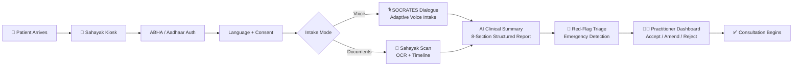

# Sahayak

## Patient Case-Taking Software — PS #26047 (Ministry of AYUSH)

<div align="center">


</div>

---

## Problem Statement

**SIH 2026 — PS #26047 | Ministry of AYUSH | Software**

Primary healthcare centers in India lack structured, digital patient case-taking workflows. Practitioners spend excessive time on manual history-taking, leading to:

* **Incomplete patient histories** — prior prescriptions, lab reports, and medications are scattered or lost
* **Unstructured intake** — symptoms are recorded ad-hoc without clinical frameworks
* **No pre-consultation preparation** — practitioners enter consultations without a summarized patient picture

Sahayak solves this with an **in-hospital kiosk** that captures structured patient history through AI-powered voice intake, document digitization, and adaptive clinical questioning — delivering a complete, practitioner-ready case summary before consultation begins.

---

## Solution — Sahayak

An AI-powered **Patient Case-Taking Software** deployed as a fixed **in-hospital kiosk station**, designed for practitioner-supervised intake at primary healthcare centers.



### How It Works

| Step | What Happens | Who |
|------|-------------|-----|
| 1. **Arrive** | Patient walks up to the Sahayak Kiosk at the hospital | Patient |
| 2. **Authenticate** | ABHA ID / Aadhaar OTP verification | Patient (at kiosk) |
| 3. **Consent** | Granular, revocable data consent recorded | Patient |
| 4. **Intake** | Adaptive SOCRATES questions via voice or touch input | Patient (practitioner supervises) |
| 5. **Scan** | Upload prescriptions, lab reports — AI digitizes and builds medical timeline | Patient / Staff |
| 6. **Summarize** | AI generates 8-section structured clinical summary with drug interaction checks | Automated |
| 7. **Triage** | Real-time emergency red-flag detection; elevated priority if critical | Automated |
| 8. **Review** | Practitioner reviews AI summary on dashboard — Accept, Amend, or Reject | Practitioner |

---

## Core Features

### 🎙️ Sahayak Listen
AI-powered multilingual voice intake using the **SOCRATES** clinical framework. Patients answer adaptive questions at the kiosk via voice or touch. Supports Hindi and English with real-time transcription via Groq Whisper.

### 📄 Sahayak Scan
Intelligent document digitization at the kiosk. Prescriptions, lab reports, and medical records are OCR-scanned using Gemini Vision, then automatically organized into a chronological medical timeline with:
- Diagnosis extraction
- Medication tracking with drug interaction alerts
- Abnormal lab value highlighting

### 📊 Sahayak Sync
Practitioner-facing web dashboard showing:
- **Patient queue** with token numbers and priority levels
- **8-section structured clinical summary** (Chief Complaint, HPI, PMH, Drug/Allergy History, Family History, Personal History, Review of Systems, Prior Investigations)
- **Accept / Amend / Reject** workflow — AI output is never auto-committed as a diagnosis
- Medical timeline viewer with uploaded documents

### 🔴 Emergency Red-Flag Triage
Real-time screening during intake for life-threatening conditions. Patients flagged as emergencies are automatically elevated to STAT priority in the practitioner's queue.

---

## Tech Stack

| Layer | Technology |
|-------|-----------|
| **Kiosk Interface** | React + Vite (fullscreen touch-optimized, kiosk mode) |
| **Practitioner Dashboard** | React + Vite + Tailwind CSS |
| **Backend API** | FastAPI (Python) |
| **AI / NLP** | Google Gemini 2.0 Flash, Groq Whisper |
| **OCR / Vision** | Gemini Vision API |
| **Database** | MongoDB (primary), JSON fallback for local dev |
| **Authentication** | ABHA / ABDM (Aadhaar OTP mock) |
| **Cloud** | AWS (S3, Lambda, DynamoDB — production) |

---

## User Roles

| Role | Interface | Responsibilities |
|------|-----------|-----------------|
| **Patient** | Sahayak Kiosk (in-hospital) | Self-service intake: authenticate, answer questions, upload documents |
| **Practitioner** | Web Dashboard (`/dashboard`) | Supervise kiosk intake, review AI summaries, accept/amend/reject, conduct consultation |
| **Staff** (optional) | Kiosk assist mode | Help elderly or differently-abled patients navigate the kiosk |

> **Note:** There is no separate mobile app deliverable. The kiosk is a fixed, in-hospital web application.

---

## Project Structure

```
Bored.io/
├── client/                    # React + Vite frontend
│   ├── src/
│   │   ├── pages/
│   │   │   ├── Kiosk.jsx         # 🏥 Main kiosk intake interface (7-step flow)
│   │   │   ├── Dashboard.jsx     # 👨‍⚕️ Practitioner review dashboard
│   │   │   └── Landing.jsx       # Landing / marketing page
│   │   ├── components/
│   │   │   ├── kiosk/            # Kiosk step components
│   │   │   │   ├── LanguageStep.jsx
│   │   │   │   ├── AbhaAuthStep.jsx
│   │   │   │   ├── ConsentStep.jsx
│   │   │   │   ├── ModeSelectStep.jsx
│   │   │   │   ├── SocratesIntakeStep.jsx
│   │   │   │   ├── DocumentScanStep.jsx
│   │   │   │   ├── IntakeSummaryStep.jsx
│   │   │   │   └── RedFlagAlertModal.jsx
│   │   │   ├── dashboard/        # Dashboard sub-components
│   │   │   └── landing/          # Landing page sections
│   │   └── utils/                # API client, speech, colors
│   └── vite.config.js
├── backend/
│   └── simple_backend/           # FastAPI backend
│       ├── main.py
│       ├── app/
│       │   ├── routes/
│       │   │   ├── kiosk.py      # Kiosk API (auth, dialogue, documents, completion)
│       │   │   ├── patients.py
│       │   │   ├── queue.py
│       │   │   ├── uploads.py
│       │   │   ├── notes.py
│       │   │   └── documents.py
│       │   └── services/
│       │       ├── ai_service.py        # Gemini + Groq integration
│       │       ├── abdm_service.py      # ABHA/ABDM verification
│       │       ├── dialogue_manager.py  # SOCRATES engine
│       │       ├── red_flag_service.py  # Emergency triage
│       │       ├── drug_interaction_service.py
│       │       └── timeline_service.py  # Medical timeline builder
│       └── requirements.txt
├── server/                       # Express.js (dev proxy)
├── docs/                         # Architecture documentation
└── start_dev.bat                 # Local development launcher
```

---

## Quick Start

### Prerequisites
- **Node.js** ≥ 18
- **Python** ≥ 3.10
- **npm** or **yarn**

### 1. Install Dependencies

```bash
# Frontend
cd client && npm install

# Backend
cd backend/simple_backend
pip install -r requirements.txt
```

### 2. Configure Environment

Create a `.env` file in the project root:

```env
GEMINI_API_KEY=your_gemini_api_key
GROQ_API_KEY=your_groq_api_key
BACKEND_URL=http://localhost:8000
FRONTEND_URL=http://localhost:5173
VITE_API_BASE_URL=http://localhost:8000
```

### 3. Start Development Servers

```bash
# Option 1: Use the launcher script
start_dev.bat

# Option 2: Manual start
# Terminal 1 — Backend
cd backend/simple_backend
python -m uvicorn main:app --host 127.0.0.1 --port 8000 --reload

# Terminal 2 — Frontend
cd client
npm run dev
```

### 4. Open in Browser

| Interface | URL |
|-----------|-----|
| **Sahayak Kiosk** | http://localhost:5173/kiosk |
| **Practitioner Dashboard** | http://localhost:5173/dashboard |
| **API Docs (Swagger)** | http://127.0.0.1:8000/docs |

---

## Kiosk Deployment Notes

For production kiosk deployment at a hospital:

- **Kiosk Mode**: Run Chrome/Edge with `--kiosk --fullscreen --disable-pinch` flags
- **Auto-Launch**: Configure the kiosk PC to auto-start the browser pointing to `/kiosk`
- **Session Reset**: The kiosk auto-resets after 5 minutes of inactivity
- **Peripheral Support**: Kiosk station should include a microphone (for voice intake) and a document scanner or webcam (for Sahayak Scan)

---

## Future Scope

Features not part of the current PS 26047 deliverable but planned for future iterations:

- **Sahayak Map** — Regional outbreak mapping and health analytics for administrators
- **Mobile Companion App** — Staff-assisted intake for elderly/differently-abled patients
- **Offline-first Mode** — Local caching and sync for low-connectivity rural PHCs
- **AYUSH-specific Prakriti Assessment** — Dosha-based intake questionnaire for Ayurveda consultations
- **Multi-kiosk Hospital Network** — Centralized dashboard managing multiple kiosk stations

---

## Team

> Built by **Team Bored.io** for SIH 2026 — Smart India Hackathon
